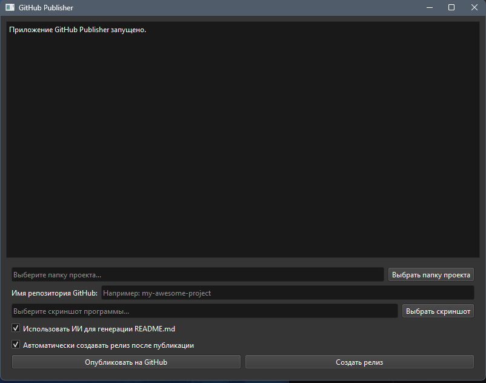

## 📸 Скриншоты


# 🚀 Краткое описание проекта

Этот инструмент делает публикацию локальных проектов на GitHub максимально простой и быстрой 🚀  
С помощью ИИ автоматически генерируется README.md, а публикация — в пару кликов 🤖  
Ты сосредоточься на коде, а остальное я сделаю за тебя 💻

# 🔑 Особенности

- 🖥️ Простой интерфейс для быстрой публикации проектов на GitHub  
- 🔍 Автоматическое определение структуры проекта и файлов  
- 🧠 Генерация README.md с помощью ИИ (Ollama) или вручную  
- 📤 Поддержка GitHub CLI для публикации в приватные репозитории  
- 🚀 Автоматическое создание релизов с генерацией информации через ИИ  

# ⚙️ Предварительная настройка

Перед установкой убедись, что ты установил GitHub CLI и выполнил команду:

```bash
gh auth refresh -h github.com -s workflow
```

Это нужно для того, чтобы приложение имело доступ к созданию релизов в твоих репозиториях.

# 🛠️ Технологии

- Python 3.8+  
- PyQt6 — графический интерфейс  
- GitHub CLI — взаимодействие с GitHub  
- Ollama (опционально) — генерация описаний через ИИ  
- requests — HTTP-запросы  

# 📦 Зависимости

- [Python](https://www.python.org/downloads/) 3.8+  
- [PyQt6](https://pypi.org/project/PyQt6/) 6.4.0+  
- [requests](https://pypi.org/project/requests/) 2.28.0+  
- [GitHub CLI](https://github.com/cli/cli)  
- [Ollama](https://ollama.com/) (опционально)

# 📥 Установка

1. Склонируй репозиторий:
   ```bash
   git clone https://github.com/ваш_пользователь/GITHUB_PROJECT.git
   ```
2. Перейди в папку проекта:
   ```bash
   cd GITHUB_PROJECT
   ```
3. Установи зависимости:
   ```bash
   pip install -r requirements.txt
   ```
4. Установи GitHub CLI:
   - Windows: `winget install GitHub.cli` или загрузи с [github.com/cli](https://github.com/cli/cli)
5. (Опционально) Для ИИ:
   - Установи Ollama с [ollama.com](https://ollama.com/)
   - Запусти сервер: `ollama serve`
   - Скачай модель: `ollama pull qwen3-coder:30b`

# ▶️ Запуск

```bash
python github_publisher_gui.py
```

# 🧪 Использование

1. Запусти приложение.
2. Выбери папку проекта.
3. Укажи имя репозитория (или оставь автоматически сгенерированное).
4. Включи генерацию README.md через ИИ (если нужно).
5. Нажми "Опубликовать на GitHub".

Приложение:
- Проанализирует структуру проекта  
- Сгенерирует README.md (с ИИ или без)  
- Создаст Git-репозиторий и первый коммит  
- Опубликует проект в приватный репозиторий  

### Создание релизов

1. После публикации проекта кнопка "Создать релиз" становится активной.
2. Можно создать релиз вручную, нажав на кнопку "Создать релиз" и заполнив информацию в диалоговом окне.
3. Также можно включить автоматическое создание релиза, установив соответствующий флажок. В этом случае релиз будет создан автоматически с информацией, сгенерированной ИИ.

При автоматическом создании релиза:
- Информация о релизе (тег, заголовок, примечания) генерируется автоматически с помощью ИИ
- Скриншот прикрепляется к релизу как загружаемый файл (если выбран)
- Скриншот автоматически добавляется в README.md проекта в раздел "Скриншоты"
- Изменения в README.md коммитятся и пушатся в репозиторий
- Релиз становится доступен на странице релизов репозитория на GitHub  

# ⚙️ Конфигурация

Для настройки Ollama API используй переменную окружения:
- `OLLAMA_API_URL` — адрес сервера Ollama (по умолчанию: http://localhost:11434/api/generate)

# 🧑‍💻 Разработка

Если ты хочешь поучаствовать в разработке:

1. Склонируй репозиторий  
2. Установи зависимости: `pip install -r requirements.txt`  
3. Запусти тесты: `python -m pytest tests/` (если есть)  
4. Создай pull request с твоими изменениями  

Все предложения и комментарии приветствуются! 🙌


